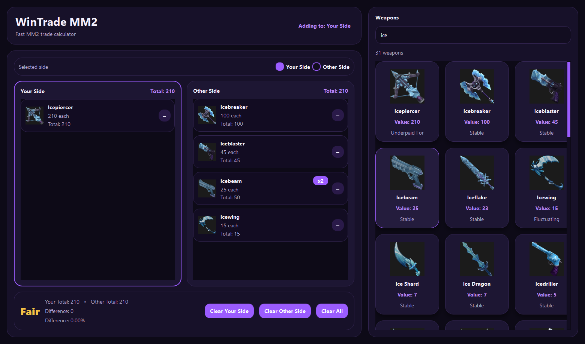

# 💜 WinTrade MM2

> Fast, modern trade calculator for **Roblox Murder Mystery 2**

WinTrade MM2 is a high-performance desktop app built with **PySide6** that helps you instantly evaluate MM2 trades. Designed for speed and clarity, it lets you quickly compare both sides of a trade and determine whether you're winning, losing, or making a fair deal.

---

## ✨ Features

- ⚡ **Real-time trade evaluation**  
  Instantly see if a trade is **Win / Lose / Fair**

- 📊 **Accurate totals & percentages**  
  Displays:
  - Total value for each side  
  - Gain / loss amount  
  - Percentage difference  

- 🖱️ **One-click adding system**  
  Click any weapon to instantly add it to the selected side

- 🔁 **Stacking system**  
  Automatically handles duplicates (x2, x3, etc.)

- 🔍 **Live search**  
  Quickly find any weapon by name

- 🖼️ **Async image loading**  
  No freezing — images load smoothly in the background

- 🚀 **Optimized performance**
  - Progressive loading (renders in batches)
  - Debounced search input
  - Smooth scrolling experience

- 🎨 **Modern UI**
  - Dark theme with purple accents  
  - Clean, minimal, distraction-free design  

---

## 📸 Preview

